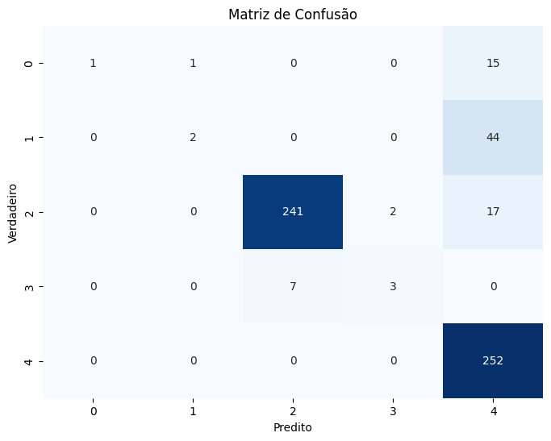
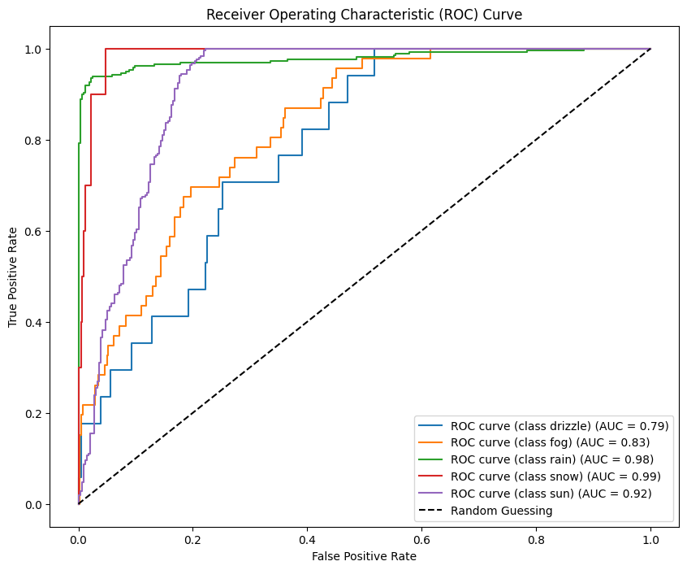
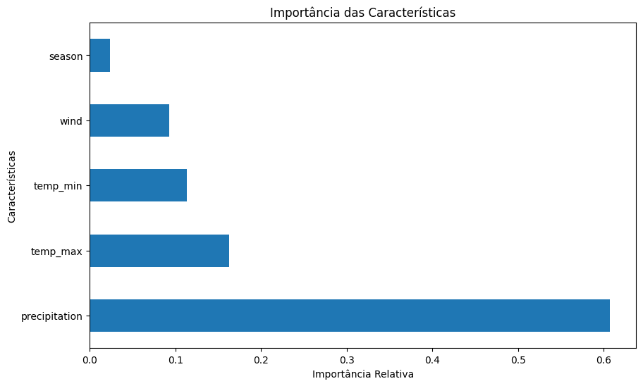

# PMPT

## Descrição

O PMPT é um projeto de análise e previsão de tempo. Ele utiliza um algoritimo de Floresta Aleatória para processar e analisar os dados, fornecendo insights valiosos e previsões precisas.

## Base Utilizada

A base que esse projeto utiliza, é  a (https://www.kaggle.com/datasets/ananthr1/weather-prediction/data).

## Tratamento de dados

Para tratar os dados, realizei as seguintes etapas:

- **Ajuste de tipos de dados**: 
  - Converti as colunas "date" e "weather" para os tipos de dados adequados.
  
- **Criação da coluna de estações do ano ("season")**:
  - Criei uma nova coluna que representa as estações do ano com base no mês.
  - A função utilizada para determinar a estação do ano é detalhada abaixo:

    ```python
    def month_to_season(month):
        if 3 <= month <= 5:
            return 0  # Primavera
        elif 6 <= month <= 8:
            return 1  # Verão
        elif 9 <= month <= 11:
            return 2  # Outono
        else:
            return 3  # Inverno
    ```

    - Se o mês estiver entre março (3) e maio (5), retorna 0, indicando a estação "primavera".
    - Se o mês estiver entre junho (6) e agosto (8), retorna 1, indicando a estação "verão".
    - Se o mês estiver entre setembro (9) e novembro (11), retorna 2, indicando a estação "outono".
    - Caso contrário (mês dezembro, janeiro ou fevereiro), retorna 3, indicando a estação "inverno".

- **Remoção da coluna "date"**: 
  - Removi a coluna "date" do conjunto de dados, pois as informações de data foram representadas de maneira mais útil pela nova coluna de estações do ano.


## Treinamento do Modelo

Para treinar o modelo de classificação, utilizei o algoritmo de Floresta Aleatória (`RandomForestClassifier`) da biblioteca `scikit-learn`. As etapas do treinamento:

1. **Importação de Bibliotecas**:
   - Importei as bibliotecas necessárias para o treinamento do modelo, incluindo `matplotlib.pyplot` para plotagem de gráficos e `PCA` da `scikit-learn` para análise de componentes principais.

2. **Criação e Treinamento do Modelo**:
   - Criei uma instância do modelo de Floresta Aleatória utilizando o construtor `RandomForestClassifier()`.
   - Em seguida, treinei o modelo utilizando o método `fit()` com os conjuntos de treinamento (`X_train`, `y_train`), onde `X_train` são os atributos/features e `y_train` é o alvo/label.

3. **Realização de Predições**:
   - Utilizei o modelo treinado para fazer previsões nos dados de teste (`X_test`) utilizando o método `predict()`.

4. **Avaliação da Precisão do Modelo**:
   - Calculei a precisão do modelo comparando as previsões feitas com os valores reais dos dados de teste (`y_test`) utilizando a métrica de acurácia (`accuracy_score`) da biblioteca `scikit-learn`.
   - A acurácia foi impressa para avaliação da performance do modelo.

## Resultados
Os resultados foram bons para o meu primeiro projeto, com uma acurácia de **0.852991452991453%** após os ajustes dos híperparametros: 
1.  **Melhores Hiperparâmetros Encontrados**:
    - {'n_estimators': 100, 'min_samples_split': 10, 'min_samples_leaf': 2, 'max_features': 'log2', 'max_depth': 30, 'bootstrap': True}
2. **Matrix de Confusão do Modelo**:
    - 
3. **Curva Roc do Modelo**:
    - 
4. **Importância das Features do Modelo**:
    -